# HTMLレンダリング
## クラス図

## 構造
呼び出しの階層は以下のようになっている。

##  node（移譲）
メインNodeは章、部、節、款、通則のいずれか

###  メインNodeの場合
子がすべてメインNodeでbody.size() == 0の時はtext
それ以外の時はlink

###  区分番号の場合
headerが「削除」の時はtext
それ以外の時はlink

###  それ以外の場合

## text

