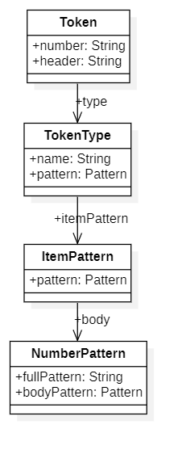

# 見出しの認識
## クラス構成

見出しを認識するための`Pattern`は
`Token`から参照される三つのクラス`TokeType, ItemPattern, NumberPattern`
で表現されている。



例えば見出し
「三の一の二から三の一の四 療養・就労両立支援指導料の注１に規定する疾患」
に対応するパターンを以下のように保持する。

* `TokenType` : 「三の一の二から三の一の四 療養・就労両立支援指導料の注１に規定する疾患」
* `ItemPattern` : 「三の一の二」および「三の一の四」
* `TokenType` : 「三」および「一」、「二」、「三」、「一」、「四」

### `TokenType`クラス
`TokenType`は見出し行全体にマッチするパターンを保持している。
以下はTokenTypeが保持する`Pattern`オブジェクトの例である。

```
^\s*(?<N>(?<F>[一二三四五六七八九十]+(の[一二三四五六七八九十]+)*)((から|及び)(?<T>[一二三四五六七八九十]+(の[一二三四五六七八九十]+)*)(まで)?)?)\s+(?<H>.*)\s*$
```

使用されているグループ名は以下の意味を持つ。

* `N` : 見出し番号全体。例えば「三の一の二から三の一の四」にマッチするグループ
* `F` : 「AからBまで」や「A及びB」の「A」にマッチするグループ
* `T` : 「AからBまで」や「A及びB」の「B」にマッチするグループ
* `H` : 「療養・就労両立支援指導料の注１に規定する疾患」にマッチするグループ

`Token`のフィールド`number`はグループ`N`にマッチしたものであり、
フィールド`header`はグループ`H`にマッチしたものである。

### `ItemPattern`クラス

`ItemPattern`クラスは見出しの数字部分(例えば「三の一の二」)にマッチするパターンを保持している。

### `NumberPattern`クラス

`NumberPattern`クラスは見出しの数字要素部分(例えば「三」や「二」)にマッチするパターンを保持している。
